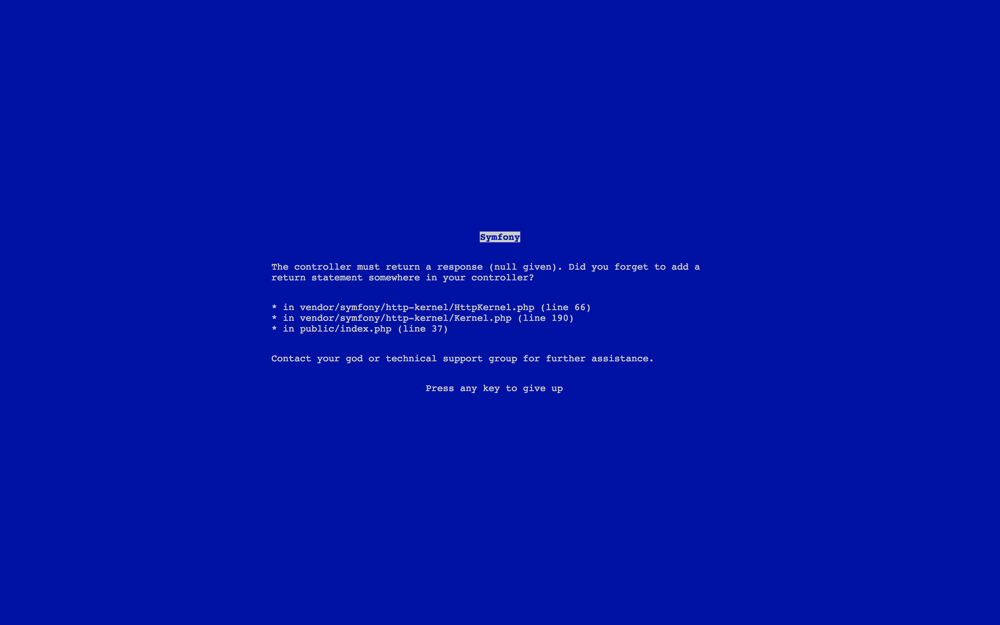

BSOD Bundle
===========

You always wanted to do some .NET shit but only knows PHP? Do yourself a favor and install that Symfony bundle. Now, you
are a real developer.

What it does
------------

It simply replace the default exception listener and replace it with that wonderful and featureless template. Bugs will 
be harder to hunt and your pride will be bigger.

Pro Tip
-------

For a better effect, switch your browser to full-screen.

Bonus
-----

A little addition in your autoloader will improve the performances of your application. Now, you can have the look & 
feel of Windows plus the behavior! Enjoy!

Disclaimer
----------

I am not responsible for the side effects that the bundle may cause to your application. You have let entered some 
Windows in your life and you will assume that choice.
